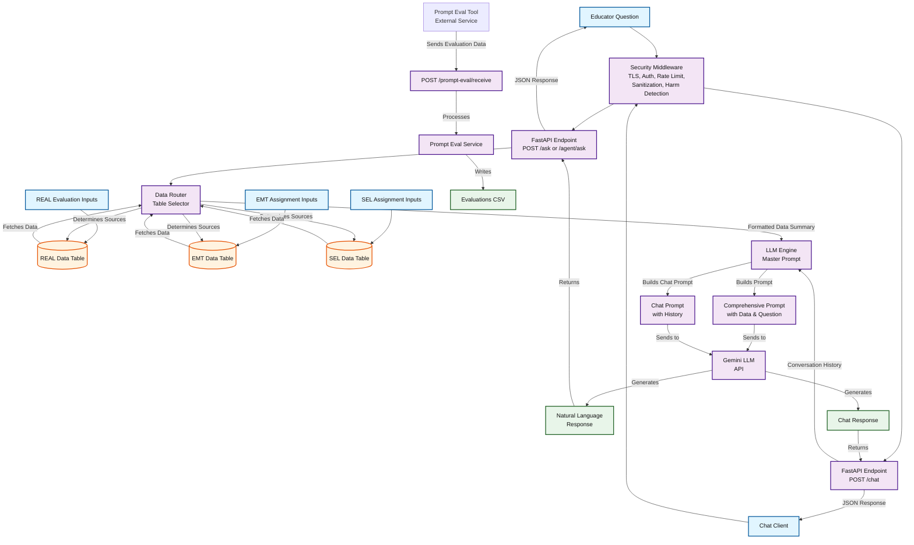
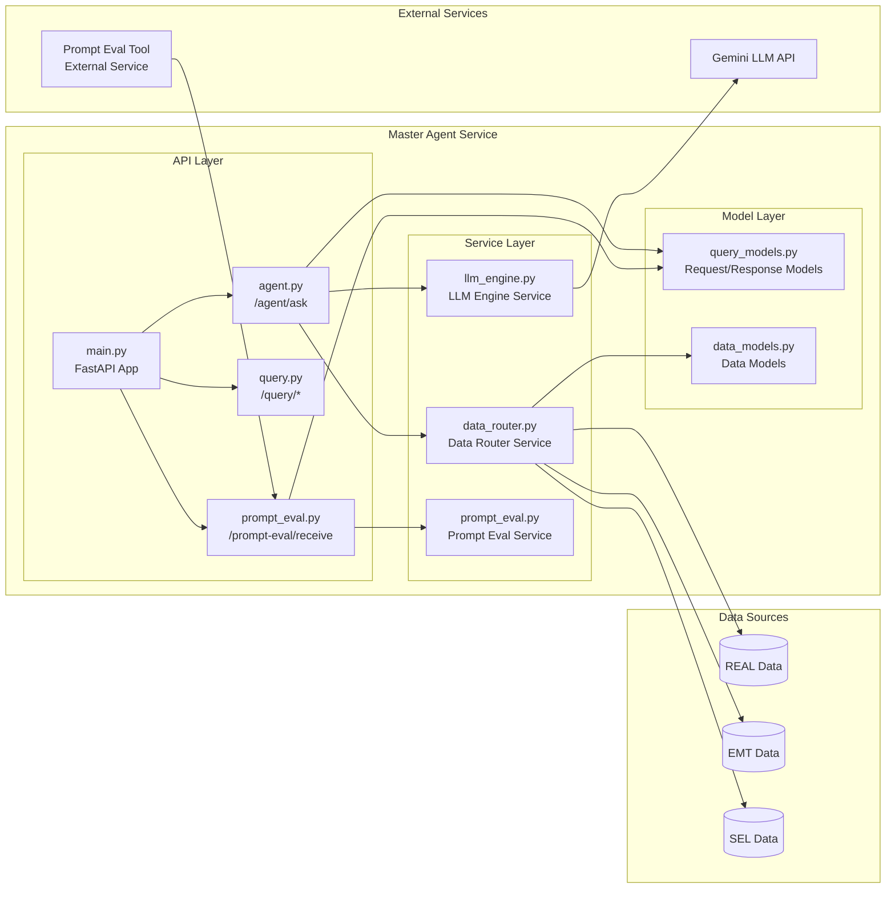
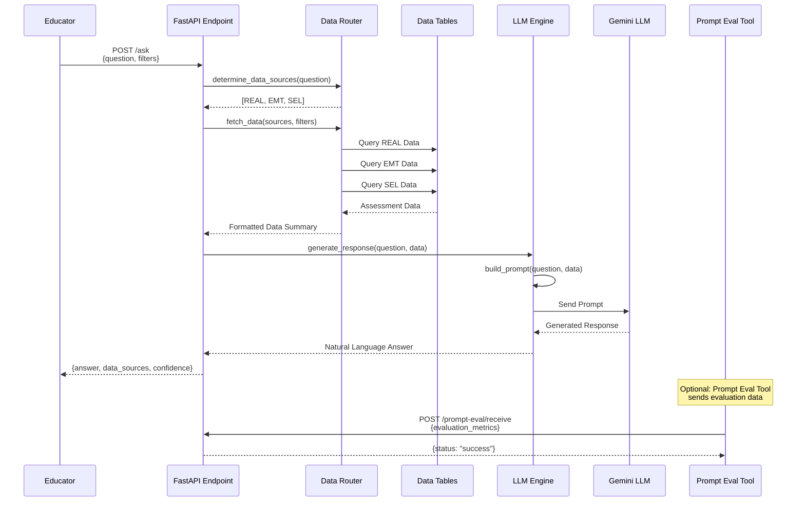
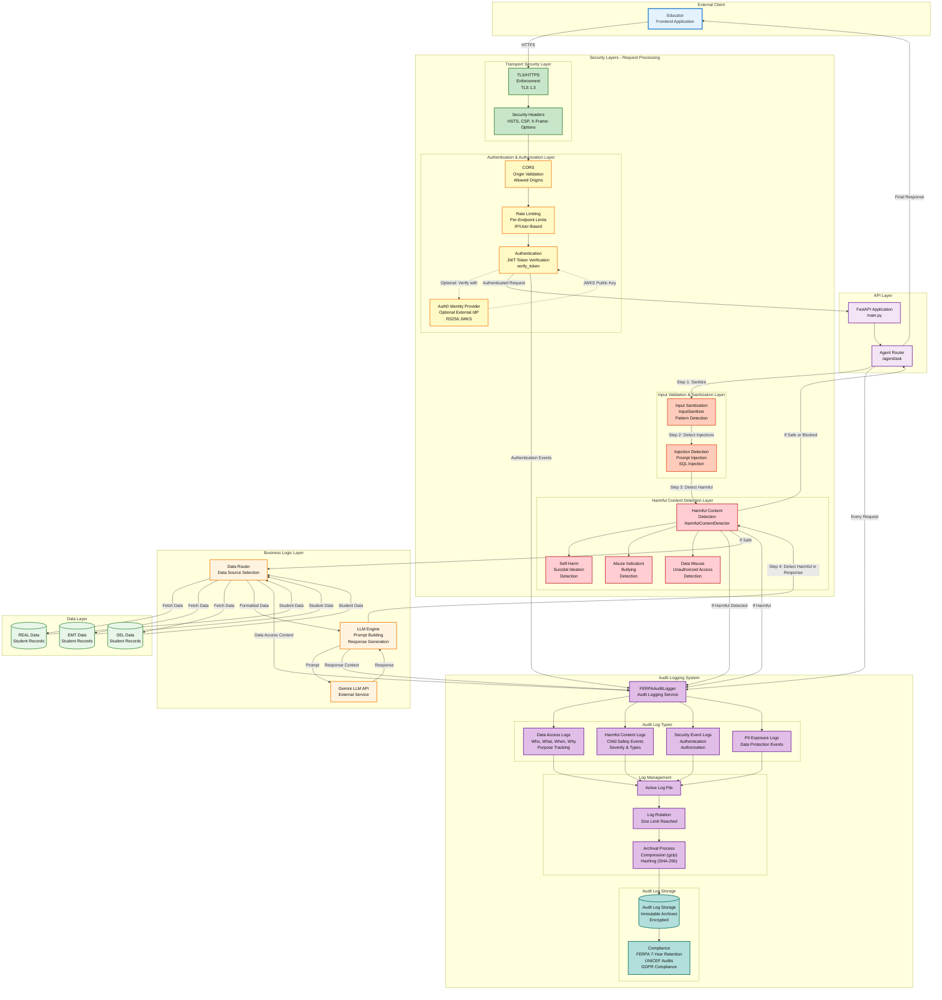
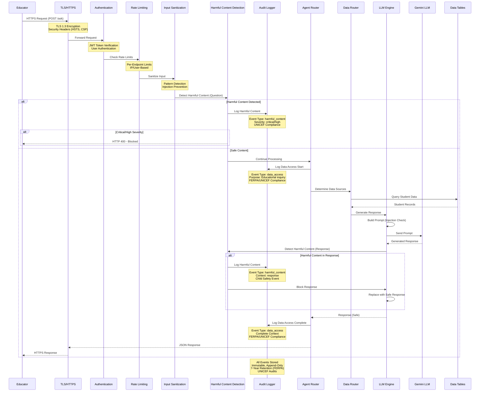

# Master Agent for Tilli

The Master Agent is a backend service that reads from multiple assessment tables (REAL Data, EMT Data, SEL Data) and answers educator questions by combining structured data with LLM-generated insights.

## Table of Contents

- [Architecture](#architecture)
  - [Master Chatbot Architecture Overview](#master-chatbot-architecture-overview)
  - [System Flow Diagram](#system-flow-diagram)
  - [Component Architecture Diagram](#component-architecture-diagram)
  - [Request Flow Sequence](#request-flow-sequence)
  - [Security Architecture & Audit Logging Diagram](#security-architecture--audit-logging-diagram)
  - [Security Flow Sequence Diagram](#security-flow-sequence-diagram)
- [Overview](#overview)
- [Project Structure](#project-structure)
- [Getting Started](#getting-started)
  - [Installation](#installation)
  - [Running the Service](#running-the-service)
    - [Test Mode](#test-mode)
    - [Development Mode](#development-mode)
    - [Production Mode (Using systemd)](#production-mode-using-systemd)
    - [Service Management Script](#service-management-script)
    - [Fail-Safe Shutdown Behavior](#fail-safe-shutdown-behavior)
    - [Cloud Deployment Guide](CLOUD_DEPLOYMENT.md)
  - [API Documentation](#api-documentation)
- [API Endpoints](#api-endpoints)
  - [Access Control (Authorization)](#access-control-authorization--new)
  - [POST /agent/ask](#post-agentask)
  - [GET /health](#get-health)
  - [GET /health/security](#get-healthsecurity)
  - [GET /query/sources](#get-querysources)
  - [GET /query/test-data](#get-querytest-data)
  - [POST /prompt-eval/receive](#post-prompt-evalreceive)
  - [GET /query/prepost](#get-queryprepost-new)
  - [GET /debug/pre-post](#get-debugpre-post-new-internal)
- [How It Works](#how-it-works)
  - [Data Routing](#data-routing)
  - [LLM Prompting](#llm-prompting)
  - [Data Integration](#data-integration-new)
- [Data Models](#data-models)
- [Testing](#testing)
- [Integration Pathway](#integration-pathway)
  - [Current State](#current-state)
  - [Next Steps for Production](#next-steps-for-production)
    - [Database Integration](#database-integration)
    - [Gemini LLM Integration](#gemini-llm-integration)
    - [Prompt Eval Tool Integration](#prompt-eval-tool-integration-optional)
    - [Advanced Routing](#advanced-routing)
    - [Integration with SEAL, AskTilli, and Dashboard](#integration-with-seal-asktilli-and-dashboard)
- [Extending the Master Agent](#extending-the-master-agent)
- [Security Considerations](#security-considerations)
  - [Quick Security Status](#quick-security-status)
  - [Before Production Deployment](#before-production-deployment)
  - [Documentation Map](#-documentation-map-what-each-file-contains)
- [License](#license)
- [Support](#support)

## Architecture

The Master Agent follows this architecture:

### Master Chatbot Architecture Overview

```mermaid
graph TB
    subgraph "External Clients & Services"
        Educator[Educator<br/>Frontend Application]
        EvalTool[Prompt Eval Tool<br/>External Service]
    end
    
    subgraph "Master Agent API Layer"
        direction TB
        FastAPI[FastAPI Application<br/>main.py]
        
        subgraph "Security Middleware Layer"
            Auth[Authentication<br/>Auth0/JWT]
            RateLimit[Rate Limiting<br/>Redis]
            Sanitizer[Input Sanitizer]
            HarmDetect[Harmful Content<br/>Detection]
            AccessControl[Data Access<br/>Control]
        end
        
        subgraph "Routers"
            AgentRouter[Agent Router<br/>/agent/ask<br/>POST /ask]
            ChatRouter[Chat Router<br/>/chat<br/>POST /chat]
            QueryRouter[Query Router<br/>/query/*<br/>GET /query/prepost]
            EvalRouter[Prompt Eval Router<br/>/prompt-eval/receive]
            DebugRouter[Debug Router<br/>/debug/pre-post]
        end
        
        subgraph "Request/Response Models"
            AskRequest[AskRequest<br/>AskResponse]
            ChatModels[ChatRequest<br/>ChatResponse<br/>ChatHistoryMessage]
            QueryModels[Query Models]
            EvalModels[PromptEvalRequest<br/>PromptEvalResponse]
        end
    end
    
    subgraph "Service Layer - Core Business Logic"
        direction TB
        
        subgraph "Data Routing Service"
            DataRouter[Data Router Service<br/>data_router.py]
            SourceSelector[Source Selector<br/>Keyword Matching]
            DataFormatter[Data Formatter<br/>format_data_for_llm]
        end
        
        subgraph "LLM Service"
            LLMEngine[LLM Engine Service<br/>llm_engine.py]
            PromptBuilder[Prompt Builder<br/>build_prompt]
            ResponseGenerator[Response Generator<br/>generate_response]
            ChatResponseGen[Chat Response Generator<br/>generate_chat_response]
        end
        
        subgraph "CSV Integration (Program-Level Aggregation)"
            CSVService[CSV Data Service<br/>csv_data.py]
        end
        
        subgraph "Evaluation Service"
            PromptEval[Prompt Eval Service<br/>prompt_eval.py]
            EvalProcessor[Evaluation Processor]
        end
    end
    
    subgraph "External AI Services"
        GeminiAPI[Google Gemini API<br/>gemini-1.5-pro<br/>HTTPS REST API]
    end
    
    subgraph "Data Layer - Assessment Tables"
        direction TB
        REALDB[(REAL Data Table<br/>Remote Learning<br/>Assessment Results)]
        EMTDB[(EMT Data Table<br/>Emotion Matching<br/>Task Results)]
        SELDB[(SEL Data Table<br/>Social-Emotional<br/>Learning Results)]
    end
    
    subgraph "Program Data Exports"
        CSVExport[(CSV Export<br/>scores_export_*.csv)]
    end
    
    subgraph "Data Sources - Input Systems"
        REALInput[REAL Evaluation<br/>Input System]
        EMTInput[EMT Assignment<br/>Input System]
        SELInput[SEL Assignment<br/>Input System]
    end
    
    subgraph "Output & Storage"
        EvaluationsCSV[(Evaluations CSV<br/>Evaluation Metrics)]
        Logs[Application Logs<br/>& Monitoring]
    end
    
    %% Client to API connections
    Educator -->|HTTP POST| FastAPI
    EvalTool -->|HTTP POST| FastAPI
    
    %% API Layer internal connections
    FastAPI --> Auth
    Auth --> RateLimit
    RateLimit --> Sanitizer
    Sanitizer --> HarmDetect
    HarmDetect --> AccessControl
    
    AccessControl --> AgentRouter
    AccessControl --> ChatRouter
    AccessControl --> QueryRouter
    AccessControl --> EvalRouter
    AccessControl --> DebugRouter
    
    AgentRouter --> AskRequest
    ChatRouter --> ChatModels
    EvalRouter --> EvalModels
    QueryRouter --> QueryModels
    
    %% Router to Service connections
    AgentRouter -->|determine_data_sources<br/>fetch_data| DataRouter
    AgentRouter -->|generate_response| LLMEngine
    ChatRouter -->|generate_chat_response| LLMEngine
    EvalRouter -->|process_evaluation| PromptEval
    %% Comparison-aware path
    AgentRouter -.->|if comparison intent| CSVService
    QueryRouter -->|/query/prepost| CSVService
    DebugRouter -->|/debug/pre-post| CSVService
    
    %% Service Layer internal connections
    DataRouter --> SourceSelector
    DataRouter --> DataFormatter
    LLMEngine --> PromptBuilder
    LLMEngine --> ResponseGenerator
    LLMEngine --> ChatResponseGen
    PromptEval --> EvalProcessor
    CSVService --> CSVExport
    
    %% Service to External Services
    LLMEngine -->|HTTPS API Call<br/>Prompt + Data| GeminiAPI
    GeminiAPI -->|Generated Response<br/>Natural Language| ResponseGenerator
    ChatResponseGen -->|HTTPS API Call<br/>Conversation| GeminiAPI
    GeminiAPI -->|Chat Response<br/>Natural Language| ChatResponseGen
    
    %% Service to Data Layer
    SourceSelector -->|Query| REALDB
    SourceSelector -->|Query| EMTDB
    SourceSelector -->|Query| SELDB
    DataFormatter -->|Formatted Data| PromptBuilder
    
    %% Data Source to Data Layer
    REALInput -->|Writes| REALDB
    EMTInput -->|Writes| EMTDB
    SELInput -->|Writes| SELDB
    
    %% Service to Output
    EvalProcessor -->|Writes| EvaluationsCSV
    FastAPI -->|Logs| Logs
    LLMEngine -->|Logs| Logs
    DataRouter -->|Logs| Logs
    
    %% Styling
    classDef clientStyle fill:#e3f2fd,stroke:#1976d2,stroke-width:3px,color:#111111
    classDef apiStyle fill:#f3e5f5,stroke:#7b1fa2,stroke-width:2px,color:#111111
    classDef serviceStyle fill:#fff3e0,stroke:#f57c00,stroke-width:2px,color:#111111
    classDef dataStyle fill:#e8f5e9,stroke:#388e3c,stroke-width:2px,color:#111111
    classDef externalStyle fill:#fce4ec,stroke:#c2185b,stroke-width:2px,color:#111111
    classDef outputStyle fill:#f1f8e9,stroke:#689f38,stroke-width:2px,color:#111111
    
    class Educator,EvalTool clientStyle
    class FastAPI,AgentRouter,ChatRouter,QueryRouter,EvalRouter,AskRequest,ChatModels,QueryModels,EvalModels,Auth,RateLimit,Sanitizer,HarmDetect,AccessControl apiStyle
    class DataRouter,SourceSelector,DataFormatter,LLMEngine,PromptBuilder,ResponseGenerator,ChatResponseGen,PromptEval,EvalProcessor serviceStyle
    class REALDB,EMTDB,SELDB,REALInput,EMTInput,SELInput dataStyle
    class GeminiAPI externalStyle
    class EvaluationsCSV,Logs outputStyle
    class CSVService serviceStyle
    class CSVExport dataStyle
```




### System Flow Diagram



### Component Architecture Diagram



### Request Flow Sequence



**Data Sources:**
- **REAL Data**: Remote Learning Assessment results from REAL Evaluation inputs
- **EMT Data**: Emotion Matching Task results from EMT Assignment inputs  
- **SEL Data**: Social-Emotional Learning results from SEL Assignment inputs

**Core Components:**
- **Data Router / Table Selector**: Routes questions to appropriate data tables
- **Master Prompt (LLM Engine)**: Constructs prompts with data and sends to Gemini LLM
- **Prompt Eval Tool Integration**: Receives evaluation data from external Prompt Eval Tool service

---

### Security Architecture & Audit Logging Diagram



**Security Layers Explained:**

1. **Transport Security Layer**
   - TLS/HTTPS enforcement (TLS 1.3)
   - Security headers (HSTS, CSP, X-Frame-Options)
   - Encrypted communication

2. **Authentication & Authorization Layer**
   - JWT token verification (HS256 local dev, RS256 Auth0)
   - Auth0 integration (optional external identity provider)
   - Rate limiting (per-endpoint, IP/user-based)
   - CORS origin validation

3. **Input Validation & Sanitization Layer**
   - Input sanitization (pattern detection)
   - Injection detection (prompt injection, SQL injection)
   - Character validation and normalization

4. **Harmful Content Detection Layer**
   - Self-harm and suicidal ideation detection
   - Abuse indicators and bullying detection
   - Data misuse and unauthorized access detection
   - Critical/High severity content blocking

5. **Audit Logging System**
   - Data access logs (who, what, when, why - purpose tracking)
   - Harmful content logs (child safety events)
   - Security event logs (authentication, authorization)
   - PII exposure logs (data protection events)
   - Immutable, append-only storage (FERPA/UNICEF compliant)

---

### Security Flow Sequence Diagram



**Security Flow Steps:**

1. **TLS/HTTPS** - Encrypted transport, security headers
2. **Authentication** - JWT token verification
3. **Rate Limiting** - Prevents abuse, DoS protection
4. **Input Sanitization** - Validates and sanitizes input
5. **Harmful Content Detection** - Scans question for harmful content
   - If harmful: Logs to audit trail, blocks if critical/high
   - If safe: Continues processing
6. **Audit Logging** - Logs data access with purpose (FERPA/UNICEF)
7. **Data Access** - Fetches student data
8. **LLM Processing** - Generates response (with injection protection)
9. **Response Security** - Scans LLM response for harmful content
   - If harmful: Logs to audit trail, blocks response
   - If safe: Returns response
10. **Final Audit Log** - Logs complete data access context

## Overview

The Master Agent serves as an intelligent interface between educators and Tilli's assessment data. When an educator asks a question about student performance, the agent:

1. **Parses the question** - Understands what the educator is asking
2. **Routes to data sources** - Data Router determines which assessment tables (REAL, EMT, SEL) are relevant
3. **Fetches data** - Retrieves data from the selected tables
4. **Formats for LLM** - Master Prompt constructs a comprehensive prompt with the data
5. **Generates insights** - Sends prompt to Gemini LLM to create natural-language responses
6. **Returns actionable information** - Provides intervention ideas, insights, and trends
7. **Optional evaluation** - Can send prompts to Prompt Eval Tool for evaluation tracking

## Project Structure

```
master-agent/
├── app/
│   ├── main.py                 # FastAPI application entry point
│   ├── routers/
│   │   ├── agent.py           # Main /ask endpoint router
│   │   └── query.py           # Query testing endpoints
│   ├── services/
│   │   ├── data_router.py     # Data source routing logic
│   │   └── llm_engine.py      # LLM prompt generation and calls
│   └── models/
│       ├── query_models.py    # API request/response models
│       └── data_models.py     # Assessment data structure models
├── tests/
│   └── test_agent.py          # Unit and integration tests
├── README.md
└── requirements.txt
```

## Getting Started

### Installation

1. Navigate to the master-agent directory:
   ```bash
   cd master-agent
   ```

2. Create a virtual environment (recommended):
   ```bash
   python -m venv venv
   source venv/bin/activate  # On Windows: venv\Scripts\activate
   ```

3. Install dependencies:
   ```bash
   pip install -r requirements.txt
   ```

4. Configure Gemini API key (optional, but recommended):
   ```bash
   export GEMINI_API_KEY="your-api-key-here"
   ```
   
   **Note:** If the Gemini API key is not configured, the service will use mock responses for testing. To get a Gemini API key:
   - Visit [Google AI Studio](https://makersuite.google.com/app/apikey)
   - Create a new API key
   - Set it as an environment variable or add to your `.env` file

#### Where to enter the API key (GEMINI_API_KEY)

Set the environment variable in one of these places:

- Windows PowerShell (current session):
  ```powershell
  $env:GEMINI_API_KEY = '<your-api-key-here>'
  ```
- Linux/macOS shell (current session):
  ```bash
  export GEMINI_API_KEY="<your-api-key-here>"
  ```
- systemd service (production):
  - Edit `deployment/master-agent.service` and add:
    ```
    [Service]
    Environment=GEMINI_API_KEY=<your-api-key-here>
    ```
  - Then reload and restart:
    ```bash
    sudo systemctl daemon-reload
    sudo systemctl restart master-agent
    ```
- .env file (if you use a process manager that loads it):
  ```
  GEMINI_API_KEY=<your-api-key-here>
  ```

Verification:
- Start the app and check logs; if the key is set, the service will use the real Gemini API instead of mock responses.
  - If you see “GEMINI_API_KEY not found… Using mock responses.” the variable was not applied to the process.

Security tips:
- Do not commit keys to Git.
- Prefer secret stores in production (e.g., Azure Key Vault, AWS Secrets Manager, GCP Secret Manager). See `EXTERNAL_API_SECURITY.md`.

### Running the Service

#### Test Mode

Enable Test Mode to exercise the system with safe mocks and deterministic behavior:

```bash
export TEST_MODE=true
uvicorn app.main:app --host 0.0.0.0 --port 8000
```

> **Note**: `TEST_MODE` primarily mocks the LLM and external APIs. It does **not** disable Authentication or Rate Limiting.
> - To disable authentication, set `ENABLE_AUTH=false`.
> - Rate limiting remains active (using memory by default in dev).

Endpoints:
- GET `/test/config` — current test mode configuration and behaviors
- POST `/test/self` — runs a short self-test battery (sanitization, harmful content detection, LLM mock path, audit log smoke)

#### Development Mode

Start the FastAPI server for development:

```bash
uvicorn app.main:app --reload --host 0.0.0.0 --port 8000
```

The service will be available at `http://localhost:8000`.

#### Production Mode (Using systemd)

For production deployments on Linux, use the systemd service:

**1. Install the service:**
```bash
sudo ./deployment/manage-service.sh install
sudo systemctl enable master-agent.service  # Enable on boot (optional)
```

**2. Start the service:**
```bash
sudo systemctl start master-agent
# or
sudo ./deployment/manage-service.sh start
```

**3. Check service status:**
```bash
sudo systemctl status master-agent
# or
sudo ./deployment/manage-service.sh status
```

**4. Stop the service (graceful shutdown - fail-safe):**
```bash
sudo systemctl stop master-agent
# or
sudo ./deployment/manage-service.sh stop
```

**5. Restart the service:**
```bash
sudo systemctl restart master-agent
# or
sudo ./deployment/manage-service.sh restart
```

**6. Reload the service (graceful reload):**
```bash
sudo systemctl reload master-agent
# or
sudo ./deployment/manage-service.sh reload
```

#### Service Management Script

The `deployment/manage-service.sh` script provides a convenient way to manage the service:

```bash
# Make script executable (first time only)
chmod +x deployment/manage-service.sh

# Available commands
./deployment/manage-service.sh start      # Start service
./deployment/manage-service.sh stop       # Stop service (graceful shutdown - fail-safe)
./deployment/manage-service.sh restart    # Restart service
./deployment/manage-service.sh reload     # Reload service (graceful)
./deployment/manage-service.sh status     # Show status and recent logs
./deployment/manage-service.sh install    # Install service file
./deployment/manage-service.sh help       # Show help message
```

#### Fail-Safe Shutdown Behavior

The service implements **fail-safe shutdown** - when stopping, it:
- ✅ **Rejects all new requests** immediately (fail-safe mode)
- ✅ **Allows in-flight requests** to complete gracefully
- ✅ **Waits up to 30 seconds** for requests to complete
- ✅ **Prevents new data access** during shutdown
- ✅ **Ensures audit logs** are written before shutdown

**Response when service is stopping:**
```json
{
  "error": "Service Unavailable",
  "message": "Service is shutting down. Please try again later.",
  "service_state": "stopping",
  "fail_safe": true
}
```

For detailed information about service management, see [SERVICE_MANAGEMENT.md](SERVICE_MANAGEMENT.md).

**Quick Reference:** See [USER_GUIDE.md](USER_GUIDE.md) for a quick command reference.

#### Cloud Deployment Guide

For instructions on deploying to cloud providers (AWS, GCP, Azure) using Docker and managed services, see the [Cloud Deployment Guide](CLOUD_DEPLOYMENT.md).


### API Documentation

Once the service is running, visit:
- **Interactive API docs**: `http://localhost:8000/docs`
- **Alternative docs**: `http://localhost:8000/redoc`

## API Endpoints

### Access Control (Authorization) — NEW

When authentication is enabled (`ENABLE_AUTH=true`, set `JWT_SECRET_KEY`), endpoints are protected by role:

- Public (no auth required):
  - `GET /health`
- Admin only:
  - `GET /health/security` (all formats, including `?format=summary|html`)
  - `GET /query/prepost`
  - `GET /debug/pre-post`
- Authenticated educator/staff:
  - `POST /agent/ask` and `POST /ask`

Development defaults:
- By default, `ENABLE_AUTH` is false, so all endpoints can be exercised during development.
- For production, set:
  - `ENABLE_AUTH=true`
  - `JWT_SECRET_KEY=<strong secret>`
  - Issue JWTs with a `role` claim (`admin`, `educator`), and `sub` as user id.

Swagger “Authorize”:
- Use `Bearer <jwt>` in the Authorize dialog to call protected endpoints from `/docs`.

### Integrating with External Authentication (OIDC/JWT) — NEW

You can integrate this API with an Identity Provider (IdP) such as Google Workspace, Microsoft Entra ID (Azure AD), Clever, Auth0, or Okta using OpenID Connect (OIDC). The API validates IdP-issued JWTs and maps IdP roles to app roles.

Recommended flow:
1. Register this API in your IdP (an “application” or “API” registration).
2. Configure environment variables (below) so the API can validate tokens via JWKS.
3. Issue a token from your IdP (via your login flow) and paste in Swagger “Authorize” as `Bearer <token>`.

Environment variables:
```
ENABLE_AUTH=true
JWT_SECRET_KEY=<fallback-secret-for-local-only>

# OIDC mode
AUTH_MODE=oidc
OIDC_ISSUER=https://login.microsoftonline.com/<tenant-id>/v2.0
OIDC_AUDIENCE=<your-api-client-id-or-audience>
# Optional: override; otherwise discovered via issuer's well-known config
OIDC_JWKS_URL=https://login.microsoftonline.com/<tenant-id>/discovery/v2.0/keys

# Role mapping
ROLE_CLAIM=roles           # or 'groups' or 'custom:role'
ROLE_MAPPING_JSON={"Admin":"admin","Teacher":"educator","Educator":"educator"}
```

Implementation notes:
- The API verifies `iss` (issuer), `aud` (audience), signature (via JWKS), and token expiry.
- The `ROLE_CLAIM` is extracted from the token and mapped via `ROLE_MAPPING_JSON` to the app roles used by `require_admin` / `require_educator`.
- For API gateways doing JWT validation, you can set `AUTH_MODE=gateway` and trust forwarded headers/JWT (ensure network trust or mTLS).

Testing:
- Obtain a JWT from your IdP (e.g., device code flow or via your frontend).
- In `/docs`, click “Authorize”, enter: `Bearer <paste-token>`, then hit protected endpoints (e.g., `/health/security`).
- If a token lacks the required role, you’ll receive `403`.

### POST /agent/ask

Main endpoint for educator questions.

**Request:**
```json
{
  "question": "How are my Grade 1 students doing in self-awareness?",
  "grade_level": "Grade 1",
  "student_id": "optional_student_id",
  "classroom_id": "optional_classroom_id"
}
```

**Response:**
```json
{
  "answer": "Based on the assessment data from SEL assignments, EMT...",
  "data_sources": ["SEL", "EMT"],
  "confidence": "high"
}
```

#### Comparison-aware questions (NEW)

The agent detects pre/post comparison intent from keywords like "before", "after", "growth", "change", "progress".
When detected, it will:
- Load PRE and POST rows from the CSV export (see Data Integration below)
- Build a comparison summary (per-metric pre, post, delta) for the requested grade
- Inject the summary into the LLM prompt context to improve the answer

Example:
- "How did Grade 1 perform before and after the program?"

Notes:
- In development, the LLM uses mock responses unless `GEMINI_API_KEY` is set, but the comparison summary is still computed and passed through.

### POST /chat — NEW

**Conversational SEL Assessment Analysis Endpoint**

This endpoint mirrors the emt-api `chat()` function structure and provides a conversational interface for analyzing SEL (Social Emotional Learning) assessment data. It supports conversation history and accepts SEL scores in the format used by Anjula's backend.

**Scope for UNRWA Pilot**: This endpoint focuses on **REAL** and **SEL** assessments only. EMT (Emotion Matching Tasks) is not included in the UNRWA pilot.

**Request:**
```json
{
  "message": "How are students performing in self-awareness?",
  "scores": {
    "testType": "POST",
    "totalStudents": 25,
    "school": "Lincoln Elementary",
    "assessment": "child",
    "overall_level_distribution": {
      "beginner": 2,
      "growth": 10,
      "expert": 13
    },
    "category_level_distributions": {
      "self_awareness": {"beginner": 1, "growth": 8, "expert": 16},
      "social_management": {"beginner": 3, "growth": 12, "expert": 10},
      "social_awareness": {"beginner": 0, "growth": 7, "expert": 18},
      "relationship_skills": {"beginner": 4, "growth": 11, "expert": 10},
      "responsible_decision_making": {"beginner": 2, "growth": 9, "expert": 14},
      "metacognition": {"beginner": 1, "growth": 10, "expert": 14},
      "empathy": {"beginner": 2, "growth": 13, "expert": 10},
      "critical_thinking": {"beginner": 3, "growth": 11, "expert": 11}
    }
  },
  "history": [
    {
      "role": "user",
      "text": "What are the overall trends?"
    },
    {
      "role": "assistant",
      "text": "Overall, students are showing strong performance..."
    }
  ]
}
```

**Response:**
```json
{
  "response": "Based on the assessment data, students are performing well in self-awareness with 16 students at expert level, 8 at growth level, and only 1 at beginner level. This represents strong foundational skills in recognizing and understanding their emotions."
}
```

**Supported Assessments** (4 types):
1. **child** - Picture-based SEL assessment for Grade 1 students
2. **parent** - Caregiver questionnaire measuring SEL skills from parent's perspective
3. **teacher_report** - Teacher-completed survey assessing SEL skills in classroom settings
4. **teacher_survey** - Teacher self-assessment of their own SEL competencies

**Features**:
- Conversation history support for contextual responses
- Multi-language support (English and Arabic)
- SEL expert system instruction
- Authentication and security measures (same as /agent/ask)
- Harmful content detection for both questions and responses
- Audit logging for FERPA/UNICEF compliance

**Testing**:
```bash
python scripts/test_chat_endpoint.py
```

See [UNRWA_PILOT_CONFIG.md](UNRWA_PILOT_CONFIG.md) for configuration details.

### GET /health

Basic health check endpoint.

**Response:**
```json
{
  "status": "healthy",
  "version": "0.1.0"
}
```

### GET /health/security

**Comprehensive Security Health Check Endpoint** ✅ **NEW**

Validates that all security countermeasures are active and functioning properly. This endpoint checks:

- ✅ **Service Status** - Service is running
- ✅ **Transport Security** - TLS/HTTPS enforcement
- ✅ **Authentication** - Authentication configuration
- ✅ **Rate Limiting** - Rate limiting is active
- ✅ **Input Validation** - Input sanitization is working
- ✅ **Harmful Content Detection** - Harmful content detection is active
- ✅ **Audit Logging** - Audit logging is configured
- ✅ **External API** - Gemini API connectivity
- ✅ **Security Headers** - Security headers middleware
- ✅ **CORS** - CORS configuration

**Response:**
```json
{
  "timestamp": "2024-01-01T12:00:00Z",
  "overall_status": "healthy",
  "service_version": "0.1.0",
  "checks": {
    "service": {
      "status": "healthy",
      "message": "Service is running",
      "details": {...}
    },
    "transport_security": {
      "status": "healthy",
      "message": "TLS/HTTPS configuration checked",
      "details": {
        "environment": "production",
        "tls_enforced": true,
        "https_enforced": true
      }
    },
    "authentication": {
      "status": "degraded",
      "message": "Authentication configuration checked",
      "details": {
        "authentication_enabled": false,
        "jwt_secret_configured": false,
        "issues": ["Authentication not enabled in production"]
      }
    },
    ...
  },
  "summary": {
    "total_checks": 10,
    "healthy": 9,
    "degraded": 1,
    "unhealthy": 0,
    "critical": 0,
    "issues": [
      {
        "check": "authentication",
        "status": "degraded",
        "message": "Authentication configuration checked",
        "issues": ["Authentication not enabled in production"]
      }
    ],
    "overall_status": "degraded"
  }
}
```

**HTTP Status Codes:**
- `200 OK` - Healthy or Degraded (details in response body)
- `503 Service Unavailable` - Unhealthy or Critical issues

**Use Cases:**
- **Monitoring Systems** - Automated monitoring can check `/health/security` to ensure security measures are active
- **Incident Response** - Quickly identify which security measures are not functioning
- **Compliance Audits** - Demonstrate that security countermeasures are active (UNICEF, FERPA)
- **Deployment Verification** - Verify security configuration after deployment
- **Alerting** - Integration with monitoring tools (PagerDuty, Datadog, etc.) to alert on security failures

**Example Usage:**
```bash
# Check security health status
curl https://api.example.com/health/security

# For monitoring systems (returns 503 if unhealthy/critical)
# Use HTTP status code for alerts:
# 200 = OK (healthy or degraded)
# 503 = Service Unavailable (unhealthy or critical)
```

### GET /query/sources

Identify which data sources would be used for a question (useful for testing).

**Example:**
```
GET /query/sources?question=How are students doing in emotion matching?
```

### GET /query/test-data

Fetch test/mock data for specified sources (useful for development).

**Example:**
```
GET /query/test-data?sources=EMT,SEL,REAL
```

### POST /prompt-eval/receive

Receives evaluation data from the external Prompt Eval Tool service.

**Request:**
```json
{
  "prompt": "The full prompt that was evaluated",
  "question": "Original educator question",
  "response": "LLM response that was evaluated",
  "data_summary": {...},
  "evaluation_metrics": {...},
  "timestamp": "2024-01-01T12:00:00"
}
```

**Response:**
```json
{
  "status": "success",
  "message": "Evaluation data received and processed successfully"
}
```

**Note:** This endpoint receives data FROM the Prompt Eval Tool (external service), not the other way around.

### GET /query/prepost (NEW)

Compute PRE vs POST comparison from the uploaded CSV dataset.

Query params:
- `school` (optional) — e.g., "School 1"
- `grade` (optional) — e.g., "Grade 1"
- `assessment` (optional) — e.g., "child", "parent", "teacher_report"
- `file_name` (optional) — CSV file name in `data/` (defaults to latest)

Example:
```
GET /query/prepost?school=School%201&grade=Grade%201&assessment=child
```

Response (shape):
```json
{
  "filters": {...},
  "result": {
    "summary": {
      "total_pre": 41,
      "total_post": 2,
      "rows_pre": 5,
      "rows_post": 1
    },
    "metrics": {
      "social_awareness_expert": { "pre": 12, "post": 0, "delta": -12 }
    }
  }
}
```

### GET /debug/pre-post (NEW, internal)

Debug endpoint to inspect raw PRE/POST summaries and computed comparison.

Query params:
- `grade` (required) — e.g., "Grade 1"
- `assessment` (optional) — e.g., "child"
- `file_name` (optional) — defaults to latest CSV in `data/`

Example:
```
GET /debug/pre-post?grade=Grade%201&assessment=child
```

Returns:
- `pre` and `post` summaries (per-metric sums, total_students)
- `comparison` object (pre, post, delta per metric)

## How It Works

> **📖 For detailed explanations of:**
> - **How components are connected:** See [System Integration & Component Connections](TECHNICAL_OVERVIEW.md#-system-integration--component-connections) in TECHNICAL_OVERVIEW.md
> - **Agent decision-making logic:** See [Agent Decision-Making Logic](TECHNICAL_OVERVIEW.md#-agent-decision-making-logic) in TECHNICAL_OVERVIEW.md

### Data Routing

The `DataRouter` service (Table Selector) uses keyword matching to determine which assessment tables are relevant to a question:

- **EMT Data (Emotion Matching Task)**: Triggered by keywords like "emotion", "emotion matching", "emt", "emotion assignment"
- **REAL Data (Remote Learning Assessment)**: Triggered by keywords like "remote learning", "real", "real evaluation", "academic performance"
- **SEL Data (Social-Emotional Learning)**: Triggered by keywords like "sel", "sel assignment", "self-awareness", "self-management", "social awareness"

**TODO**: Replace keyword matching with more sophisticated NLP/ML-based routing once requirements are clearer.

### LLM Prompting

The `LLMEngine` service implements the **Master Prompt** component:

1. Receives formatted data from the Data Router
2. Constructs a comprehensive prompt that includes:
   - The educator's question
   - Formatted assessment data from relevant sources (REAL, EMT, SEL)
   - Instructions for generating actionable insights

3. Sends prompt to **Gemini LLM** (integrated)
   - ✅ Gemini API integration implemented
   - ✅ Automatically uses Gemini API if `GEMINI_API_KEY` environment variable is set
   - ✅ Falls back to mock responses if API key is not configured or API call fails
   - Default model: `gemini-1.5-pro` (configurable via `model_name` parameter)

4. Optionally sends to **Prompt Eval Tool** for evaluation tracking
   - **TODO**: Configure Prompt Eval Tool integration
   - **TODO**: Implement Evaluations CSV generation

5. Returns natural-language responses with:
   - Data-driven insights
   - Intervention ideas
   - Trend analysis
   - Recommendations

### Data Integration (NEW)

The service loads program-level aggregated assessment exports from `data/`:
- File: `data/scores_export_2025-11-16.csv`
- Fields include: `School`, `Grade`, `Assessment`, `Test Type` (PRE/POST), `Total Students`, and multiple SEL domain metrics as counts for Beginner/Growth/Expert.

Helpers in `app/services/csv_data.py`:
- `load_scores(file_name)` — load and normalize CSV rows
- `filter_scores(grade=..., test_type=..., school=..., assessment=...)` — filter rows
- `compute_prepost_comparison(rows)` — aggregated PRE vs POST metrics
- `build_comparison_summary(pre_rows, post_rows)` — concise object for LLM context

### Temporarily Enabling/Disabling Data Sources (EMT/REAL/SEL) — NEW

You can toggle specific sources off without code changes using an environment variable. This is useful if a source is temporarily unavailable (e.g., EMT).

- Disable EMT only:
  - Windows PowerShell:
    ```powershell
    $env:DISABLE_SOURCES = 'EMT'
    ```
  - Linux/macOS:
    ```bash
    export DISABLE_SOURCES="EMT"
    ```
  - systemd:
    ```
    [Service]
    Environment=DISABLE_SOURCES=EMT
    ```
    Then:
    ```bash
    sudo systemctl daemon-reload
    sudo systemctl restart master-agent
    ```
- Disable multiple sources:
  ```bash
  export DISABLE_SOURCES="EMT,REAL"
  ```
- Re-enable a source:
  - Remove it from `DISABLE_SOURCES` or unset the variable:
    ```bash
    unset DISABLE_SOURCES         # Linux/macOS
    # or
    Remove-Item Env:DISABLE_SOURCES  # PowerShell
    ```

Behavior:
- Disabled sources are not selected by the router and are not fetched/added to the LLM summary.
- The “include all by default” logic respects the disable list.

## Data Models

### Assessment Data Sources

Based on the Master Agent architecture:

- **REAL Data**: Results from REAL Evaluation inputs
- **EMT Data**: Results from EMT Assignment inputs
- **SEL Data**: Results from SEL Assignment inputs

**Note**: Current data models are placeholders. Actual database schemas will be integrated once provided. The data flows from assessment inputs → tables → Data Router → Master Prompt → Gemini LLM.

## Testing

Run the test suite:

```bash
pytest tests/
```

Or with coverage:

```bash
pytest tests/ --cov=app --cov-report=html
```

## Integration Pathway

### Current State

The Master Agent currently:
- ✅ Accepts educator questions via API
- ✅ Routes questions to appropriate data sources (keyword-based)
- ✅ Returns mock/placeholder data
- ✅ Generates contextual responses (mock LLM)

### Next Steps for Production

1. **Database Integration**
   - [ ] Obtain actual database schemas for REAL Data, EMT Data, and SEL Data tables
   - [ ] Replace mock data in `data_router.py` with actual SQL queries
   - [ ] Add database connection pooling and error handling
   - [ ] Implement proper data filtering by grade_level, student_id, classroom_id

2. **Gemini LLM Integration**
   - [x] Gemini API integration implemented in `llm_engine.py`
   - [x] Automatic fallback to mock responses if API unavailable
   - [x] Error handling and logging implemented
   - [ ] Fine-tune prompts based on real usage
   - [ ] Add response validation and rate limiting

3. **Prompt Eval Tool Integration** (Optional)
   - [ ] Configure Prompt Eval Tool
   - [ ] Implement prompt evaluation tracking
   - [ ] Generate Evaluations CSV output

4. **Advanced Routing**
   - [ ] Replace keyword matching with NLP-based routing
   - [ ] Add learning from question patterns
   - [ ] Implement confidence scoring for data source selection

5. **Integration with SEAL, AskTilli, and Dashboard**
   - [ ] Define API contracts with other Tilli services
   - [ ] Add authentication/authorization
   - [ ] Implement rate limiting and caching
   - [ ] Add logging and monitoring

## Extending the Master Agent

### Adding a New Data Source

1. Add data model in `app/models/data_models.py`
2. Add keywords in `app/services/data_router.py`
3. Implement data fetching logic in `data_router.fetch_data()`
4. Update `format_data_for_llm()` to include new source

### Customizing LLM Prompts

Modify `llm_engine.build_prompt()` to adjust the prompt structure. The current prompt includes:
- Context about the Master Agent role
- The educator's question
- Formatted assessment data
- Instructions for response generation

### Adding New Endpoints

1. Create a new router file in `app/routers/`
2. Define endpoints using FastAPI decorators
3. Include the router in `app/main.py`

## Security Considerations

**⚠️ IMPORTANT: Security review required before production deployment.**

The Master Agent handles sensitive student assessment data and must be secured before production use. 

### Current Protection Level: **MODERATE (7/10)**

**✅ Well Protected:**
- Input validation & sanitization (9/10)
- Prompt injection protection (9/10)
- Rate limiting (8/10)
- Error handling (8/10)
- CORS configuration (7/10)

**⚠️ Needs Attention:**
- Authentication (4/10 → 8/10 when enabled) - **Currently optional by default**
- Authorization & data access control (8/10) - **Implemented, needs enforcement**
- PII protection in outputs (3/10) - **Limited**

**❌ Not Protected:**
- PII redaction in responses - LLM responses may contain PII
- Audit logging - Basic, not FERPA-compliant

**✅ Data Access Control:**
- Educator-classroom and student-classroom relationship enforcement
- School-level isolation (multi-tenant security)
- Early validation before data retrieval
- Generic error messages (zero data leakage)
- Audit logging for access denied events
- Feature flag: Set `ENABLE_DATA_ACCESS_CONTROL=true` to enforce
- See [DATA_ACCESS_CONTROL.md](DATA_ACCESS_CONTROL.md) for details

**✅ Transport Security:**
- TLS enforcement middleware implemented
- HSTS headers with configurable max-age
- HTTP to HTTPS redirect (automatic)
- Security headers (CSP, X-Frame-Options, etc.)
- Configure via `ENVIRONMENT=production` or `REQUIRE_TLS=true`
- See [TLS_CONFIGURATION.md](TLS_CONFIGURATION.md) for setup

### Quick Security Status

| Component | Status | Notes |
|-----------|--------|-------|
| Input Sanitization | ✅ Strong | 20+ injection patterns detected |
| Prompt Injection | ✅ Strong | Multi-layer defense |
| Rate Limiting | ✅ Good | Per-endpoint limits |
| Authentication | ⚠️ Optional | Set `ENABLE_AUTH=true` to enforce |
| Data Access Control | ✅ Implemented | Set `ENABLE_DATA_ACCESS_CONTROL=true` to enforce |
| PII Protection | ❌ Limited | No output redaction |
| Harmful Content Detection | ✅ Implemented | UNICEF-aligned child protection |
| Transport Security | ✅ Implemented | Set `REQUIRE_TLS=true` for production |
| SQL Injection | ⚠️ N/A | Not applicable (mock data) |

### Before Production Deployment

**🔴 CRITICAL (Must Fix):**
1. Set `ENABLE_AUTH=true` to enforce authentication
2. Set `ENABLE_DATA_ACCESS_CONTROL=true` to enforce access control
3. Populate educator-classroom and student-classroom assignments
4. Add PII redaction to LLM responses
5. Configure TLS/HTTPS:
   - Set `ENVIRONMENT=production` or `REQUIRE_TLS=true`
   - Configure reverse proxy for TLS termination
   - See [TLS_CONFIGURATION.md](TLS_CONFIGURATION.md)
5. Implement FERPA-compliant audit logging

**⚠️ IMPORTANT (Should Fix):**
6. Configure proper CORS origins
7. Use Redis for distributed rate limiting
8. Implement secret management (AWS Secrets Manager/Vault)
9. Add monitoring and alerting

**📚 Documentation Map (What each file contains):**
- [AUDIT_LOGGING.md](AUDIT_LOGGING.md) — FERPA/UNICEF audit logging requirements and storage strategy.
- [AUTHENTICATION_OPTIONS.md](AUTHENTICATION_OPTIONS.md) — IAM choices (OIDC/JWT, gateways), trade‑offs, and rollout.
- [BUILD_STATUS.md](BUILD_STATUS.md) — Project progress, completed items, and pending work.
- [CRITICAL_ISSUES_IMPLEMENTATION.md](CRITICAL_ISSUES_IMPLEMENTATION.md) — Step‑by‑step fixes required before production.
- [DATA_ACCESS_CONTROL.md](DATA_ACCESS_CONTROL.md) — Authorization model design; how to restrict who can read which data.
- [EXTERNAL_API_SECURITY.md](EXTERNAL_API_SECURITY.md) — Securing Gemini/API usage, keys, and rate limiting.
- [HARMFUL_CONTENT_DETECTION.md](HARMFUL_CONTENT_DETECTION.md) — Child‑safety detection, sensitivity tuning, and alerting.
- [HEALTH_CHECK.md](HEALTH_CHECK.md) — Health/security check contract; using `?format=summary|html`.
- [KNOWN_KEY_VALUES.md](KNOWN_KEY_VALUES.md) — Canonical keys/fields across data and responses.
- [PRODUCTION_SECURITY.md](PRODUCTION_SECURITY.md) — Hardening checklist for multi‑school production use.
- [SECURITY.md](SECURITY.md) — Threat model, protections, and security posture.
- [SECURITY_ASSESSMENT.md](SECURITY_ASSESSMENT.md) — Detailed assessment of protections with scoring.
- [SERVICE_MANAGEMENT.md](SERVICE_MANAGEMENT.md) — systemd/deployment commands and fail‑safe shutdown details.
- [TECHNICAL_OVERVIEW.md](TECHNICAL_OVERVIEW.md) — End‑to‑end architecture, flows, and component deep‑dive.
- [TLS_CONFIGURATION.md](TLS_CONFIGURATION.md) — TLS/HTTPS setup (reverse proxy, HSTS/CSP).
- [USER_GUIDE.md](USER_GUIDE.md) — How to run/manage the service, commands, and API usage examples.

## Development Notes

- **Placeholder Data**: Current implementation uses mock data. Look for `TODO` comments marking where actual integration should occur.
- **No Schema Assumptions**: The code intentionally avoids assuming database structure to maintain flexibility.
- **Modular Architecture**: Services are separated to allow easy replacement of routing and LLM logic.

## License

This project is part of the Tilli platform.

## Support

For questions or issues, please contact the Tilli development team.

